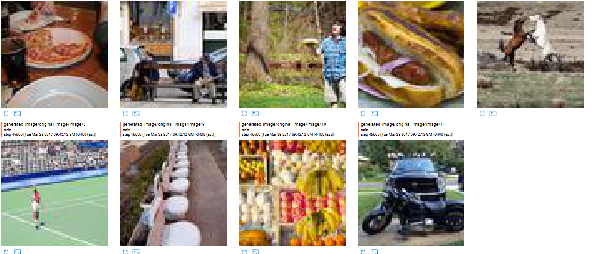

# ImageReconstructionProject

## Convolutional autoencoder

Following https://arxiv.org/pdf/1604.07379.pdf it simply encodes the image, then decode it, trying to fill the missing part.

## GAN

## RoadMap

- change discriminator to take whole image into account

- change lambda_adversarial during training

- add normalization and dropout

- Use captions to make more accurate predictions

- Data set augmentation

